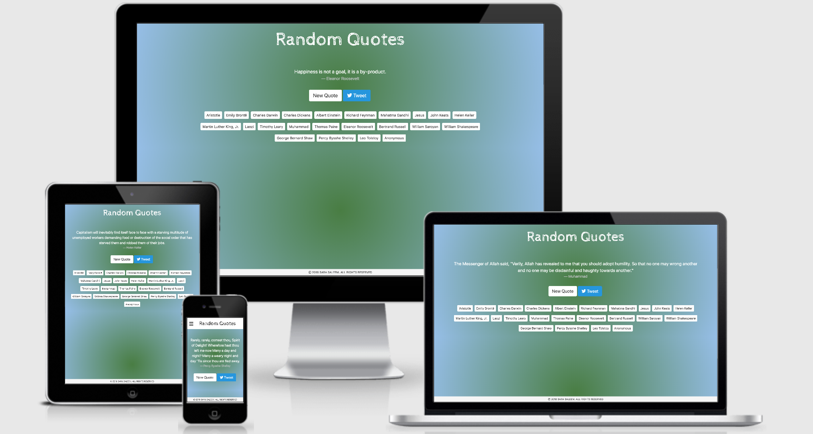

# Random Quotes Machine
A responsive website displaying random quotes extracted from [wikiquote.org](https://www.wikiquote.org/). A bunch of author buttons are availble to get quotes of specific authors. Author buttons convert into an off-canvas menu on smaller devices. Users can also post their favorite quote on Twitter using **Tweet** button.

## Built with 
- [Bootstrap 4](https://getbootstrap.com/docs/4.0/getting-started/introduction/) - A front-end component library to build responsive, mobile-first websites.
- [jQuery](https://jquery.com/) - a JavaScript library designed to simplify the client-side scripting.
- [wikiquote API](https://github.com/natetyler/wikiquotes-api) - A JavaScript module for retrieving quotes from wikiquote.org via api calls.
- [Twitter for websites](https://developer.twitter.com/en/docs/twitter-for-websites/tweet-button/overview) - A Tweet button to help users easily share website content on Twitter.
- [CSS Media Queries](https://www.w3schools.com/css/css3_mediaqueries.asp) - A popular technique to deliver a tailored style sheet to desktops, laptops, tablets, and mobile phones by defining different style rules for different media types.
- [Google Fonts](https://fonts.google.com/) - A library of 900 libre licensed fonts.
- [FontAwesome Icons](https://fontawesome.com/icons?d=gallery) - A font and icon toolkit.

## Live Version
Project demo can be explored [here](https://ssaleem.github.io/Random-Quotes/).

